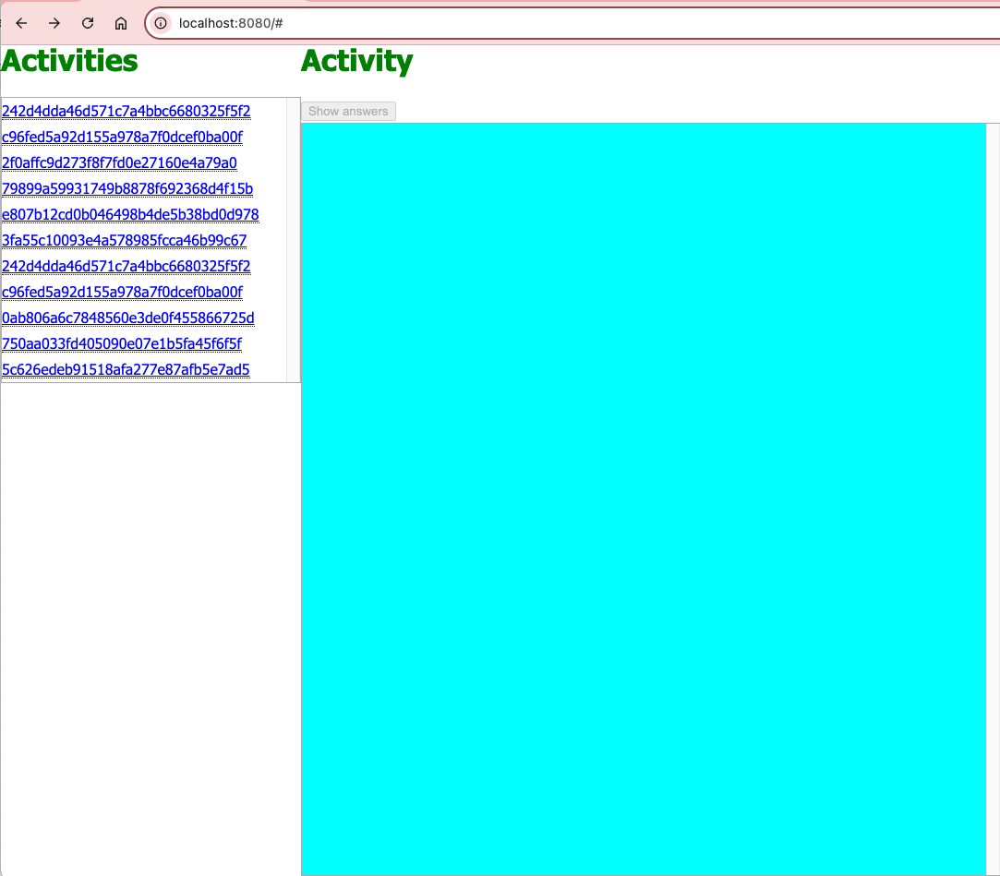
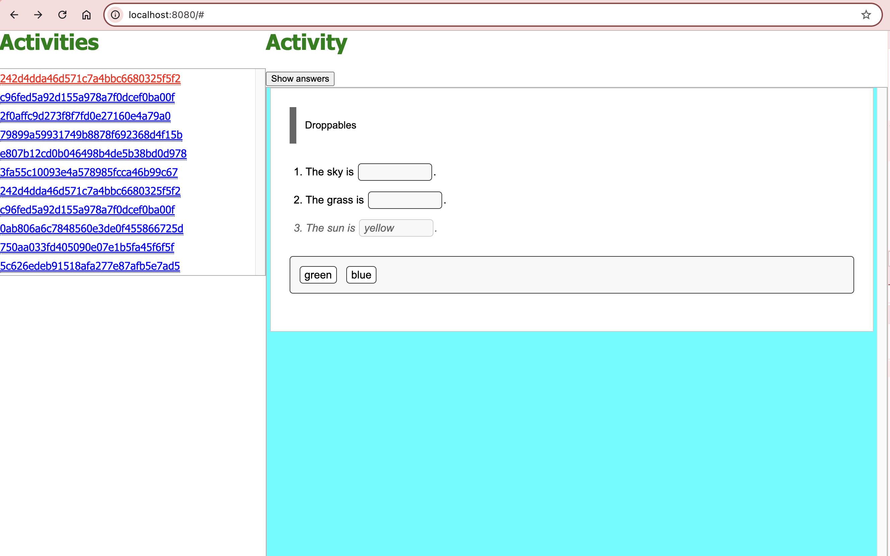

# RCF Interview Project

## Overview

The purpose of this test is to show that the developer can use javascript to fetch and inspect data, and then update a webpage with that data and act upon it as required.

### Expectations:

1. Loading and filtering data from a [`manifest.json`](manifest.json)  file
2. Populating a webpage with data from the manifest
3. Listening for click events on the webpage and responding to them
4. Fetching and loading data from a running (local) server
5. Interacting with a provided RCF api

### Unit Tests

Unit tests are not required for this technical test - the focus is on the javascript functionality and the approach the developer takes to achieve the end result. The developer should aim to keep the code clean, DRY and as small as possible. There are many tests frameworks available (we use Jest) and providing a package suitable for all candidates using all the testing frameworks would be difficult.

As a member of the team, we would normally expect unit tests to be provided to cover all of the functionality, but it is not required for this technical test. If the developer wishes to provide tests, they are welcome to do so.


## Machine Requirements

- It is expected that the user have NodeJs installed (preferably Node 18 or above).
- It is expected that the user have an IDE available (preferably VSCode - we provide a `.vscode` folder with some basic settings).

## Test Requirements

The application should load data from the [`manifest.json`](manifest.json) file and return a **filtered** list of `activities` which have a `gradableType` property of `closed-gradable`

The application should present a list of these activities (just the `id` is fine) and when clicked, it should inspect the manifest and determine where to load an activity html file from.

This list should be populated in the dom in the `#activities` element, eg:

```html
	<div id="activities">
		<!--
			output the activities from the manifest.json here

			we want to have a clickable link for each activity that will
			load the activity into the activity-container.
		-->
	</div>
```

The application should respond to a clicked activity id and load the associated activity html into memory and then insert the HTML into the webpage in the `#activity-contents` element, eg:

```html
	<div id="activity-contents">
		<!--
			output contents of activity html in here

			Then call the RCF.Application.updateContent() function, passing in the <div id="activity-contents"> element

		-->
	</div>
```

A `<button>` has been provided which should only be enabled once an activity html file has been loaded. When the button is clicked, the application should load the activity `json` data referenced by the manifest and then call the `RCF.Application.setAnswers( json )` function, passing in the json data. The button is in the dom as follows:

```html
	<div id="activity-container">
		<span class="title">Activity</span>
		<button id="showAnswersButton" disabled>Show answers</button></span>
		...
```

## Notes:

### Installation

This is a very simple project with minimal dependencies (in fact, the only dependency is the `http-server` package!)

To install the project, simply run:

```zsh
npm install
```

### html
An html page ([`index.html`](index.html)) has been provided which contains all the markup you (should) need. It includes the css and javascript files required to complete the test.

You should not need to edit this file - but feel free to change the structure if you wish to make it easier to work with.

### manifest
The manifest file ([`manifest.json`](manifest.json) ) is located in the root of the project.

The manifest file refers to files locating in a [`cdn`](cdn) folder - you should not need to edit / change any of the files in this location. Your code will need to read the contents of files (html and json) from this location depending on the activity selected from the manifest.


### javascript
Your application code is expected to go into [`js/app.js`](js/app.js) - It is up to the developer to decide if they want to create smaller es6 modules to import into this file to break up the code into smaller modules.

The application is designed to run in pure es6 and hence has no other tooling setup (babel, vite, packagers etc) - if the developer wishes to use these tools, they are free to do so, but it is not required.


## Running the server

A simple http-server has been provided in the `package.json` file. To run the server, simply run:

```zsh
npm run server
```

This will start the server on port 8080 - open your browser to http://localhost:8080 to view the page.


- styling is unimportant / not required

- http-server has been provided in package.json, and can be run with `npm run server` (or run from `node_modules` if you wish)

- unit tests are not expected for this test, but code should be kept clean, DRY and as small as possible


## Tips:

### Styling

Styling is not important for this test - the focus is on the javascript functionality. Feel free to add some basic styling if you wish, but it is not required.

### RCF API:

A version of the RCF runtime has been provided with this test - it is registered on the global `window` object as `RCF.` and has the following namespaced methods which you will need to use
  

`RCF.Application.initialize`

- This will setup the RCF runtime and only needs to be called once when the webpage first loads

`RCF.Application.updateContent( $activityContent )` *

- called with a jQuery element containing the activity HTML
- this api sets up all RCF interaction elements


`RCF.Application.setAnswers( answersJson )`

- called with the activity *json* answers object
- it will populate the activity with the correct answers

The version of RCF used in this test is quite old and relies on jQuery to be used to pass in the html element to be updated. While this is not ideal, it is a requirement for this test.

If the developer has not used jQuery before, do not panic :) - it is registerd on the global `window` object as `$` and for example, can simply be used in the test code as:

```javascript
	const $activityElement = $('#activity-contents');
	RCF.Application.updateContent( $activityElement );
```

That will wrap the `#activity-contents` element in a jQuery object and then pass it to the `updateContent` function.

## Expected output:

The finished application should look similar to this:



When clicking on an activity in the list, the rendered activity should appear in the activity container:


